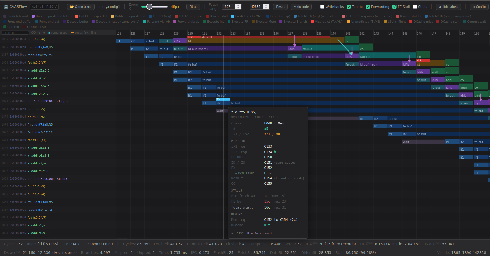

# CVA6Flow

A browser-based pipeline visualizer for the CORE-V CVA6 RISC-V core. It reconstructs the pipeline cycle by cycle from a Verilator-generated VCD, straight off the RTL, and draws every in-flight instruction as a row.



## Motivation

Simulating CVA6 in RTL provides absolute truth, but in an unreadable format. A single DAXPY run generates a ~1.29 GB VCD file where the raw signals are present, but the instruction context is lost. The waveform knows exactly when `wt_valid_i` and `commit_ack_o` toggle, but it knows nothing about the load that missed and stalled the rest of the pipeline.

CVA6Flow bridges this gap. It reconstructs the instruction-level view directly from the RTL signals, tracking every in-flight instruction through the core to visualise exactly what happened and when.

Zero guesswork. The core philosophy of this tool is uncompromising: every reported number must trace directly back to an actual RTL signal or architectural state. Early iterations relied on cycle-offset estimates and plausible proxies, but because those introduced silent errors, they were scrapped. If CVA6Flow reports a delay, the hardware proves it.

## Quick start

Build CVA6 with Verilator and run a test with VCD tracing enabled, then:

```bash
python3 CVA6Flow_tracer.py sim.vcd -o trace.json \
    --user-entry-pc 0x80003000 \
    --user-end-pc 0x8000314c \
    --disasm-list test.dump
```

Then open `CVA6Flow.html` in any browser and drag `trace.json` onto the window. There is nothing to install and nothing to serve. The viewer is a single self-contained HTML file with no dependencies.

The VCD is streamed rather than loaded, because these files grow quickly with run length and trace depth, well past what fits comfortably in memory.

## Tracer options

```bash
python3 CVA6Flow_tracer.py <vcd_path> [options]
```

| Option | Meaning |
| --- | --- |
| `vcd_path` | Path to the Verilator-generated `.vcd` |
| `-o`, `--output` | Output JSON path. Defaults to `<vcd_basename>.json` |
| `--scope-prefix` | Hierarchical prefix prepended to each whitelisted signal. Defaults to `TOP.ariane_testharness.i_ariane.i_cva6` |
| `--user-entry-pc` | Hex PC of `main`, used to find the warmup boundary. Everything committed before the first hit is marked as warmup |
| `--user-end-pc` | Hex PC of the last instruction of user code, typically the `jal ra, <exit>`. The viewer's `Main code` button uses it as the upper bound of the user-program range |
| `--disasm-list` | Path to an `objdump -dS` listing of the test ELF. Populates each record's `disasm` field by PC lookup. Records outside the listing, such as bootrom, keep `disasm=None` |
| `--stages` | Print per-stage resolution diagnostics on stderr |
| `--quiet` | Suppress the streaming progress indicator |

## Configuration and parameter sweeps

CVA6Flow targets the canonical `cv64a6_imafdc_sv39_hpdcache_wb` configuration, and it is built to survive changes to it. Structural parameters such as scoreboard depth are probed from the VCD itself rather than hard-coded, so a configuration sweep (different cache sizes and associativity, branch-predictor or return-address-stack depth, commit width, and so on) is handled without editing the tracer. Rebuild CVA6 with the new parameters, regenerate the VCD, and the same command produces a correct trace.

## How instructions are recovered

Each in-flight instruction is followed through the core's six stages:

```
fetch → decode → issue (allocates trans_id) → execute → writeback → commit
```

The `trans_id` allocated at issue is the handle that makes the rest possible. Writeback arrives on a packed `wt_valid_i` bus with one bit per port and a separate `trans_id_i` signal per port, so a writeback is matched to its instruction by looking up the trans_id of each asserting port. Commit works the same way through `commit_ack_o` and the scoreboard commit pointers.

Within each rising clock edge the order of processing is deliberate:

1. Flush detection, cascading so that a flush at execute also flushes decode and fetch
2. Commit, releasing scoreboard slots
3. Writeback
4. Issue, claiming slots
5. Decode
6. Fetch

Commit runs before issue on purpose: a slot freed this cycle can be reused the same cycle, and getting the order wrong yields a trace that looks plausible but is wrong.

The canonical configuration is `cv64a6_imafdc_sv39_hpdcache_wb`. Scoreboard depth is probed from the VCD rather than assumed, so parameter sweeps are handled without editing the tracer.

## What the viewer shows

Per instruction: fetch, decode, issue, execute, writeback and commit cycles, the allocated trans_id, whether it was flushed and why, and whether it belongs to warmup or to user code. Instruction words are masked to 16 bits when compressed, and disassembly is shown when a listing is supplied.

A few things worth calling out:

- **Forwarding arrows** from each producer to its consumer, distinguishing back-to-back writeback forwarding from values that sat in the scoreboard before issue.
- **Measurement-region filtering**, so warmup and bootrom are separated from the code you actually care about. For C programs the region is found from the `mcycle` reads, for assembly from the entry PC and the first jump to exit.
- **Miss counts that match the RTL performance counters** (mhpmevent 16 and 17), including the load, store and other split for the dcache, so the tool's numbers can be checked against the hardware's own.
- **A memory writeback track** showing each dirty line written back to memory and the eviction that caused it.
- **Stall highlighting** that tints every cycle column containing a stall, kept in step with the stall metric so the picture and the number always agree.

Plus the usual quality-of-life: fit-to-viewport zoom, PC search across the whole window, a hover panel with per-instruction detail, and collapsible panels. Every control has an in-app tooltip, so they are not repeated here.

Keys: `+` and `−` to zoom, arrows to navigate, `Home` and `End` to jump, `Esc` to close panels.

## Tested with

CVA6Flow has been tested against the CVA6 build in this organisation, [FaMAF-CVA6-Project/cva6](https://github.com/FaMAF-CVA6-Project/cva6).

If you would rather not build the core and its toolchain yourself, a ready-to-use Docker image is available with CVA6 and the simulation toolchain already set up, so you can generate VCDs straight away:

```bash
docker pull manuel313/cva6
```

Image: https://hub.docker.com/repository/docker/manuel313/cva6/general

## Requirements

- Python 3, standard library only
- Any modern browser
- Verilator and a CVA6 build, for producing VCDs

## Related

[MinorFlow](https://github.com/FaMAF-CVA6-Project/MinorFlow) is the sibling tool. It visualises gem5's MinorCPU from gem5 debug traces. CVA6Flow is deliberately built to look and behave the same way, so that a simulated pipeline and a real RTL pipeline can be put next to each other and compared cycle by cycle.

Both come out of an undergraduate thesis at FaMAF, Universidad Nacional de Córdoba, asking how closely a gem5 MinorCPU configuration can be made to match a real RISC-V core. CVA6Flow is what makes that question answerable, because it supplies the ground truth the gem5 side is measured against.

CVA6 itself is developed by the [OpenHW Group](https://github.com/openhwgroup/cva6).

## Licence

Released under the MIT Licence. See [LICENSE](LICENSE).
